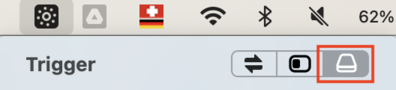

# Setup: macOS


Checklist for setting a and personalising a new macOS installation.

<!--
Increment/decrement section numbers:
  1. Select target text in visual mode
  2. Execute:
       :s/^## \(\d\+\)/\='## '.(submatch(1)+1)/
     Adapt '+1' according to desired level of incrementation/decrementation
    
Regenerate table of contents:
  1. Make sure the vim-markdown-toc Vim plugin [1] is installed
  2. Execute:
       :let [g:vmt_list_item_char, g:vmt_max_level]= ['- [ ]', 3]
  3. Remove '<DELETE>' from '<DELETE>vim-markdown-toc GFM'
  4. Save the file 
  5. Re-add '<DELETE>' to above comment (prevent accidential regeneration)

[1] https://github.com/mzlogin/vim-markdown-toc
-->

## Contents

<!-- <DELETE>vim-markdown-toc GFM -->

- [ ] [1. Install updates](#1-install-updates)
- [ ] [2. Disable iCloud Drive](#2-disable-icloud-drive)
- [ ] [3. Customise trackpad gestures](#3-customise-trackpad-gestures)
- [ ] [4. Customise modifier keys](#4-customise-modifier-keys)
- [ ] [5. Disable the 🌐 key](#5-disable-the--key)
- [ ] [6. Disable startup sound](#6-disable-startup-sound)
- [ ] [7. Disable power chime](#7-disable-power-chime)
- [ ] [8. Disable floating screenshot thumbnails](#8-disable-floating-screenshot-thumbnails)
- [ ] [9. Disable adaptive screen brightness](#9-disable-adaptive-screen-brightness)
- [ ] [10. Make Desktop icons snap to the grid](#10-make-desktop-icons-snap-to-the-grid)
- [ ] [11. Disable "Click wallpaper to reveal desktop"](#11-disable-click-wallpaper-to-reveal-desktop)
- [ ] [12. Customise menu bar](#12-customise-menu-bar)
- [ ] [13. Customise Dock](#13-customise-dock)
- [ ] [14. Customise Spaces](#14-customise-spaces)
- [ ] [15. Customise Finder](#15-customise-finder)
- [ ] [16. Customise TextEdit](#16-customise-textedit)
- [ ] [17. Restore keyboard brightness keys on the physical keyboard](#17-restore-keyboard-brightness-keys-on-the-physical-keyboard)
- [ ] [18. Install custom keyboard layout](#18-install-custom-keyboard-layout)
- [ ] [19. Install Xcode Command Line Tools](#19-install-xcode-command-line-tools)
- [ ] [20. Install Homebrew](#20-install-homebrew)
- [ ] [21. Install Homebrew formulas from Brewfile](#21-install-homebrew-formulas-from-brewfile)
- [ ] [22. Set Bash as the default shell](#22-set-bash-as-the-default-shell)
- [ ] [23. Apply iTerm2 settings](#23-apply-iterm2-settings)
- [ ] [24. Apply settings of optional tools](#24-apply-settings-of-optional-tools)
  - [ ] [Android Studio](#android-studio)
  - [ ] [Visual Studio Code](#visual-studio-code)
- [ ] [25. Install dotfiles](#25-install-dotfiles)
- [ ] [26. TODO: Install sudoers file](#26-todo-install-sudoers-file)
- [ ] [27. Install fonts](#27-install-fonts)
- [ ] [28. Install eduroam](#28-install-eduroam)
- [ ] [29. Configure Google Chrome](#29-configure-google-chrome)
- [ ] [30. Configure Google Drive](#30-configure-google-drive)
- [ ] [31. Configure Fluor](#31-configure-fluor)

<!-- vim-markdown-toc -->

## 1. Install updates

System updates:

1. Go to _**System Settings → General → Software Update**_
1. Install all available updates

App updates:

1. Go to _**App Store → Updates**_
1. If there are any updates, click on _**Update All**_

[↑ Top](#contents)

## 2. Disable iCloud Drive

1. Go to _**System Settings → Apple ID → iCloud → Apps Using iCloud**_
1. Set _**iCloud Drive**_ to _**Off**_

> **Note:** this prevents distracting options in file opening and saving dialogs.

[↑ Top](#contents)

## 3. Customise trackpad gestures

Enable tap to click:

1. Go to _**System Preferences → Trackpad**_
1. Make sure that the _**Point & Click**_ tab is open
1. Enable _**Tap to click**_

Disable opening of the Notification Centre when swiping left from the right edge of the trackpad with two fingers:

1. Go to _**System Preferences → Trackpad**_
1. Open the _**More Gestures**_ tab
1. Disable _**Notification Centre**_

> **Note:** disabled to prevent accidential triggering when swiping/scrolling with two fingers.

Enable dragging of windows with three fingers:

1. Go to _**System Preferences → Accessibility → Pointer Control → Trackpad Options...**_
1. Enable _**Use trackpad for dragging**_
1. Set _**Dragging style**_ to _**Three-Finger Drag**_

[↑ Top](#contents)

## 4. Customise modifier keys

1. Go to _**System Preferences → Keyboard → Keyboard Shortcuts... → Modifier Keys**_
1. Change the below items to the following values:
   | Item                    | Value             |
   |:------------------------|:------------------|
   | _**Caps Lock (⇪) key**_ | _**⌃ Control**_   |
   | _**Control (⌃) key**_   | _**⇪ Caps Lock**_ |
   | _**Option (⌥) key**_    | _**⌘ Command**_   |
   | _**Command (⌘) key**_   | _**⌥ Option**_    |

> **Note:** the above must be done for every connected keyboard (e.g the built-in keyboard and the external Magic Keyboard). Keyboards can be selected in the _**Select keyboard**_ dropdown list.

[↑ Top](#contents)

## 5. Disable the 🌐 key

1. Go to _**System Preferences → Keyboard**_
1. Set _**Press 🌐 key to**_ to _**Do Nothing**_

> **Note:** this makes the 🌐 key act like a normal _fn_ (function) key (e.g. for typing F1, F2, etc.). The 🌐 key functionality is not really needed as the input source can always be changed with `Ctrl-Space`.

[↑ Top](#contents)

## 6. Disable startup sound

1. Go to _**System Settings → Sound**_
1. Disable _**Play sound on startup**_

[↑ Top](#contents)

## 7. Disable power chime

1. Execute the following:
   ```bash
   defaults write com.apple.PowerChime ChimeOnNoHardware -bool true
   ```
1. Log out of macOS and log in again

> **Note:** the power chime is a sound that plays when connecting a charging cable.

[↑ Top](#contents)

## 8. Disable floating screenshot thumbnails

1. Press `Cmd-Shift-5`
1. Open the _**Options**_ dropdown list in the menu bar at the bottom of the screen
1. Disable _**Show Floating Thumbnail**_

> **Note:** this saves all screenshots immediately to the file system and prevents the floating thumbnail animation in the lower right corner of the screen.

[↑ Top](#contents)

## 9. Disable adaptive screen brightness

1. Go to _**System Preferences → Displays**_
1. Disable _**Automatically adjust brightness**_

[↑ Top](#contents)

## 10. Make Desktop icons snap to the grid

1. Right-click on the Desktop background
1. Click on _**Show View Options**_
1. Set _**Sort By**_ to _**Snap to Grid**_

[↑ Top](#contents)

## 11. Disable "Click wallpaper to reveal desktop"

1. Go to _**System Preferences → Desktop & Dock**_
1. Scroll down to the _**Desktop & Stage Manager**_ section
1. Open the _**Click wallpaper to reveal desktop**_ dropdown list
1. Select _**Only in Stage Manager**_

> **Note:** this feature has been added and enabled by default by macOS 14 (Sonoma).

[↑ Top](#contents)

## 12. Customise menu bar

1. Go to _**System Preferences → Control Centre**_
1. Change the below items to the following values:
   | Item            | Value                         |
   |:----------------|:------------------------------|
   | _**Bluetooth**_ | _**Show in Menu Bar**_        |
   | _**Focus**_     | _**Don't Show in Menu Bar**_  |
   | _**Sound**_     | _**Always Show in Menu Bar**_ |
   | _**Spotlight**_ | _**Don't Show in Menu Bar**_  |
1. Under _**Battery**_, enable _**Show Percentage**_
1. Rearrange the icons in the menu bar by holding ⌘ and dragging the icons with the mouse

[↑ Top](#contents)

## 13. Customise Dock

1. Go to _**System Preferences → Desktop & Dock**_
1. Enable _**Automatically hide and show the Dock**_
1. Disable _**Show suggested and recent apps in Dock**_

[↑ Top](#contents)

## 14. Customise Spaces 

Disable automatic rearrangement of Spaces:

1. Go to _**System Preferences → Desktop & Dock**_
1. Scroll down to the _**Mission Control**_ section
1. Disable _**Automatically rearrange Spaces based on most recent use**_

Create desired number of Spaces:

1. Swipe up with four fingers to open Mission Control
1. Move cursor to the top of the screen to reveal the Spaces strip
1. Click on the + on the right side of the Spaces strip to add additional Spaces

[↑ Top](#contents)

## 15. Customise Finder

Customise sidebar:

1. Go to _**Finder → Settings → Sidebar**_
1. Enable the following items and disable all other items:
   | Item                            | Enabled |
   |:--------------------------------|:-------:|
   | _**Applications**_              | ✅      |
   | _**Desktop**_                   | ✅      |
   | _**\<Home>**_                   | ✅      |
   | _**Hard disks**_                | ✅      |
   | _**External disks**_            | ✅      |
   | _**CDs, DVDs and iOS Devices**_ | ✅      |

Disable hiding of filename extensions and filename extension warnings:

1. Go to _**Finder → Settings → Advanced**_
1. Enable _**Show all filename extensions**_
1. Disable _**Show warning before changing an extension**_

Set default directory:

1. Go to _**Finder → Settings → General**_
1. Open the _**New Finder windows show**_ dropdown list
1. Select _**Desktop**_

Restrict search to current folder:

1. Go to _**Finder → Settings → Advanced**_
1. Open the _**When performing a search**_ dropdown list
1. Select _**Search the Current Folder**_

Show Path Bar and Status Bar:

1. Go to _**Finder → View**_
1. Enable _**Show Path Bar**_
1. Enable _**Show Status Bar**_

[↑ Top](#contents)

## 16. Customise TextEdit

Set default window style and behaviour:

1. Go to _**TextEdit → Settings → New Document**_
1. Set _**Format**_ to _**Plain text**_
1. Set _**Width**_ to _**80**_
1. Set _**Plain text font**_ to _**Menlo Regular 12**_
1. Disable **all** the options in the _**Options**_ section

Disable markup rendering:

1. Go to _**TextEdit → Settings → Open and Save**_
1. Enable _**Display HTML files as HTML code instead of formatted text**_
1. Enable _**Display RTF files as RTF code instead of formatted text**_

Disable automatic setting of filename extensions:

1. Go to _**TextEdit → Settings → Open and Save**_
1. Disable _**Add ".txt" extension to plain text files**_

[↑ Top](#contents)

## 17. Restore keyboard brightness keys on the physical keyboard

> **Note:** this step is only necessary if the physical keyboard does **not** have keyboard brightness keys (usually bundled with the F5 and F6 keys), which is typically the case for newer (i.e. post Apple silicon)  models.

1. Save the following as **`~/Library/LaunchAgents/com.local.KeyRemappings.plist`**:
   ```xml
   <?xml version="1.0" encoding="UTF-8"?>
   <!DOCTYPE plist PUBLIC "-//Apple//DTD PLIST 1.0//EN" "http://www.apple.com/DTDs/PropertyList-1.0.dtd">
   <plist version="1.0">
   <dict>
       <key>Label</key>
       <string>com.local.KeyRemapping</string>
       <key>ProgramArguments</key>
       <array>
           <string>/usr/bin/hidutil</string>
           <string>property</string>
           <string>--set</string>
           <!-- Keys:                                                           -->
           <!--   0xC000000CF:  Dictation                                       -->
           <!--   0x10000009B:  Focus                                           -->
           <!--   0xFF00000008: Keyboard brightness up                          -->
           <!--   0xFF00000009: Keyboard brightness down                        -->
           <string>{"UserKeyMapping":[
               {
                 "HIDKeyboardModifierMappingSrc": 0xC000000CF,
                 "HIDKeyboardModifierMappingDst": 0xFF00000009
               },
               {
                 "HIDKeyboardModifierMappingSrc": 0x10000009B,
                 "HIDKeyboardModifierMappingDst": 0xFF00000008
               }
           ]}</string>
       </array>
       <key>RunAtLoad</key>
       <true/>
   </dict>
   </plist>
   ```
1. Log out of macOS and log in again

Traditonally, Apple keyboards had two keys for decreasing and increasing the keyboard brightness bundled with the F5 and F6 keys. However, newer models (roughly since the introduction of Apple silicon) have the _Dictation_ and _Focus_ keys at the place of these keyboard brightness keys.

The above [launch agent](https://developer.apple.com/library/archive/documentation/MacOSX/Conceptual/BPSystemStartup/Chapters/CreatingLaunchdJobs.html) script reverts this change and makes the _Dictation_ and _Focus_ keys act as keyboard brightness keys.

See also:

- https://www.idownloadblog.com/2022/03/25/bring-back-keyboard-brightness/
- https://github.com/amarsyla/hidutil-key-remapping-generator/issues/33#issuecomment-1431296356

[↑ Top](#contents)

## 18. Install custom keyboard layout


✅  See [**weibeld-setup/install-keyboard-layout**](https://github.com/weibeld-setup/install-keyboard-layout)

[↑ Top](#contents)

## 19. Install Xcode Command Line Tools

1. Execute the following to launch the installation dialog:
   ```bash
   xcode-select --install
   ```
1. Complete the installation through the installation dialog

[↑ Top](#contents)

## 20. Install Homebrew

```bash
bash -c "$(curl -fsSL https://raw.githubusercontent.com/Homebrew/install/HEAD/install.sh)"
```

> **Note:** see instructions on [brew.sh](https://brew.sh/).

[↑ Top](#contents)

## 21. Install Homebrew formulas from Brewfile


✅ See [**weibeld-setup/install-brewfile**](https://github.com/weibeld-setup/install-brewfile)

[↑ Top](#contents)

## 22. Set Bash as the default shell

1. Execute the following:
   ```bash
   echo "$HOMEBREW_PREFIX"/bin/bash | sudo tee -a /etc/shells >/dev/null
   chsh -s "$HOMEBREW_PREFIX"/bin/bash
   sudo chsh -s "$HOMEBREW_PREFIX"/bin/bash
   ```
1. Quit and reopen the terminal application

> **Note:** this sets the version of Bash that has been installed by Homebrew as the default shell. By default, macOS uses Zsh as the default shell.

[↑ Top](#contents)

## 23. Apply iTerm2 settings


✅ See [**weibeld-setup/settings-iterm2**](https://github.com/weibeld-setup/settings-iterm2)

[↑ Top](#contents)

## 24. Apply settings of optional tools

### Android Studio


✅ See [**weibeld-setup/settings-android-studio**](https://github.com/weibeld-setup/settings-android-studio)

### Visual Studio Code


✅ See [**weibeld-setup/settings-vscode**](https://github.com/weibeld-setup/settings-vscode)

## 25. Install dotfiles


✅ See [**weibeld-setup/install-dotfiles**](https://github.com/weibeld-setup/install-dotfiles)

[↑ Top](#contents)

## 26. TODO: Install sudoers file


✅ See [**weibeld-setup/install-sudoers**](https://github.com/weibeld-setup/install-sudoers)

> **TODO:** adapt for macOS.

[↑ Top](#contents)

## 27. Install fonts


✅ See [**weibeld-setup/install-fonts**](https://github.com/weibeld-setup/install-fonts)

[↑ Top](#contents)

## 28. Install eduroam


✅ See [**weibeld-setup/install-eduroam**](https://github.com/weibeld-setup/install-eduroam)

[↑ Top](#contents)

## 29. Configure Google Chrome

Set Chrome as the default web browser:

1. Go to _**System Settings → Desktop & Dock**_
1. Scroll down to the _**Widgets**_ section
1. Set _**Default web browser**_ to _**Google Chrome**_

Set dowload directory:

1. Go to _**Chrome → Settings → Downloads**_
1. Set _**Location**_ to _**Desktop**_

[↑ Top](#contents)

## 30. Configure Google Drive

1. Launch _**Google Drive**_
1. Skip all the options in the setup dialog
1. Click on the _**Google Drive**_ icon in the menu bar
1. Click on the _**gear icon**_
1. Go to _**Preferences → Google Drive**_
1. Select _**Mirror files**_
1. Click on _**Change folder location**_
1. In the file opening dialog, create a new folder, such as **`~/Desktop/Google Drive`**
1. Click on _**Confirm location → Save**_
1. Wait for the sync of the files from Google Drive to the local folder to complete

> **Note:** this creates a local directory that is mirrored with Google Drive. That means, all the files from Google Drive will be downloaded to this directory, and any files that are locally added to this directory will be uploaded to Google Drive.

[↑ Top](#contents)

## 31. Configure Fluor

Grant permissions:

1. Launch _**Fluor**_
1. Do not enable any notifications
1. When prompted, grant the necessary permissions for Fluor in _**System Settings**_

Enable start at login:

1. Click on the _**Fluor**_ icon in the menu bar
1. Enable _**Start Fluor at login**_

Set trigger:

1. Click on the _**Fluor**_ icon in the menu bar
1. In the _**Trigger**_ section, enable the rightmost option:<br />
   

> **Note:** this trigger option allows changing the Fluor mode (i.e. locking and unlocking the function keys) by simply pressing the _fn_ key.

[↑ Top](#contents)
